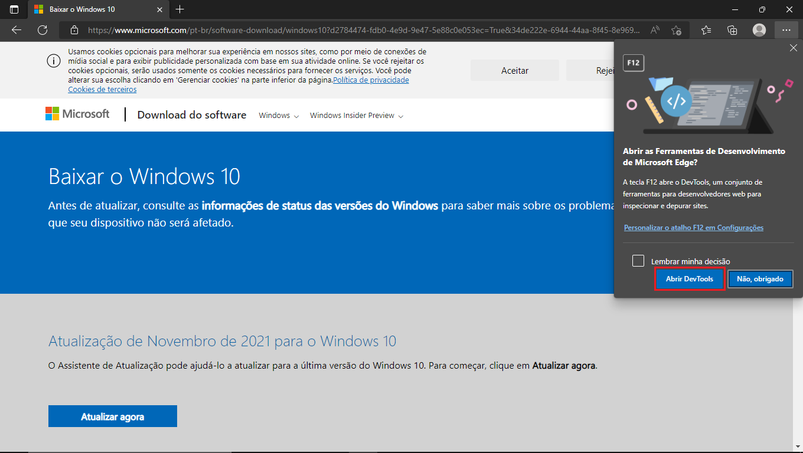
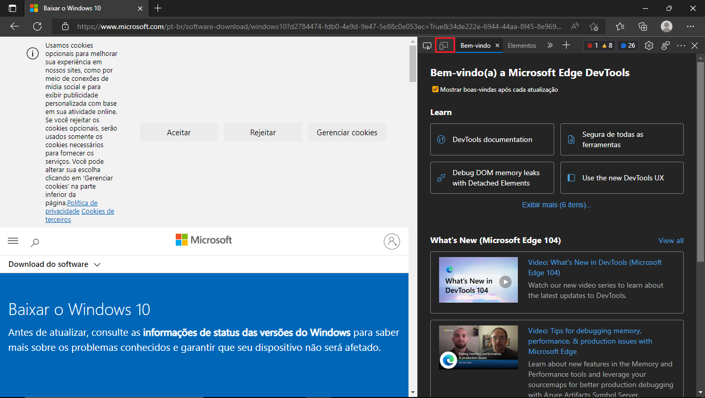
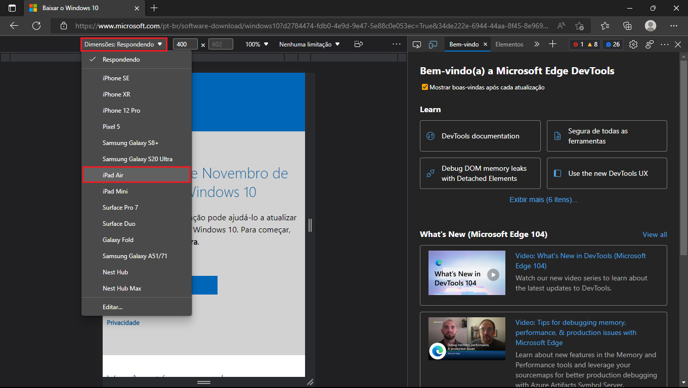
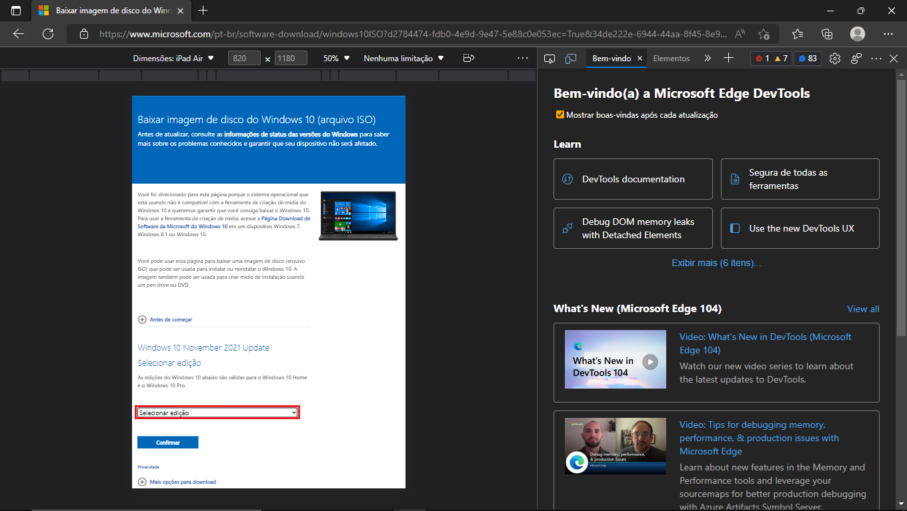
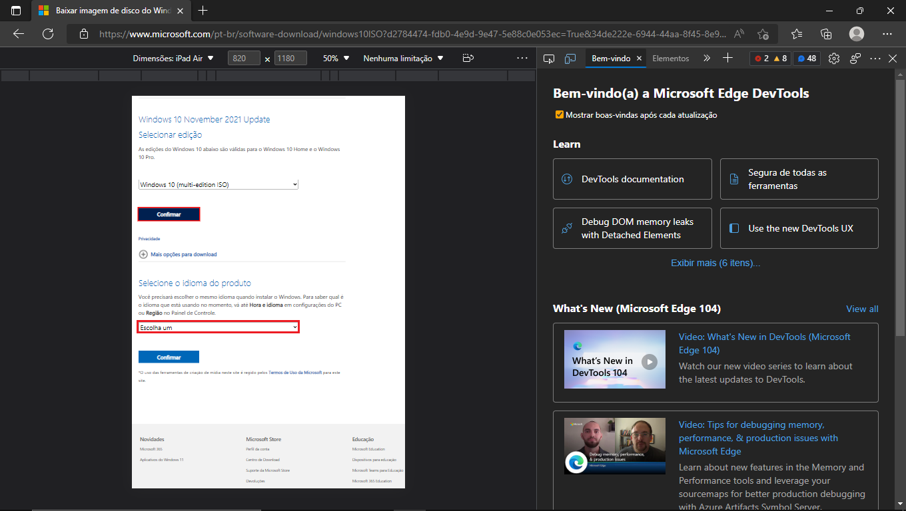
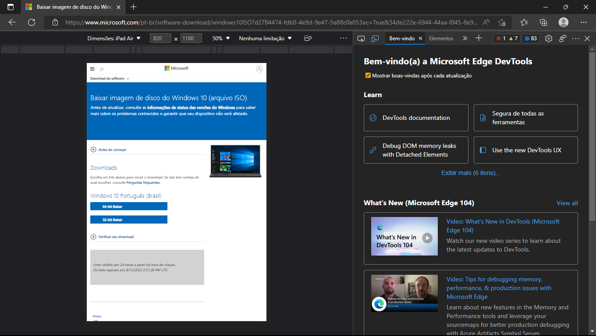

# inplace

Está ferramenta pode ser utilizada para alterar o registro do sistema para trocar a edição do Windows 10 Pro para o Home/Home Single Language  

-----Baixando ISO Windows 10 através do navegador-----  
  
Para baixar a ISO utilizamos o Microsoft Edge como navegador, mas as opções em outros navegadores são similares  
  
1_Acessar o link: https://www.microsoft.com/pt-br/software-download/windows10  
2_Apertar a tecla F12 do teclado para abrir o "DevTools"  
3_Na janela que abrir clicar no "Abrir DevTools"  
  
  
  
4_Procurar o botão de emulação de dispositivo  
  
 
  
5_Selecionar o menu "Dimensões: respondendo" e selecionar um dispositivo macOS ou IOS  
  
 
  
6_Apertar a tecla F5 do dispositivo e aguardar a tela recarregar  
7_Após o carregamento clicar em "selecionar uma edição" e escolher "windows 10 (mult-edition ISO)" e clicar em "Confirmar"  
  
 
  
8_Selecionar o idioma e clicar em "Confirmar" 
  
 
  
9_Escolher a arquitetura x64 ou x32 e clicar em cima para iniciar o download  
  
  
  
  
  
-----Baixando a ISO do Windows 10 através do Media Creation Tool-----  
  
1_Baixar a ISO do Windows 10 seguindo as instruções do link: https://support.microsoft.com/pt-br/windows/criar-um-arquivo-iso-para-o-windows-10-38547366-1dcb-7afd-1726-9eb222d72705  
  
  
  
-----Instruções após baixar a ISO -usando arquivo .bat-----  
  
1_Executar como admin o arquivo "inplace.bat"  
2_Selecionar a versão que deseja instalar  
3_Executar "setup.exe" dentro da ISO baixada  
4_Selecionar "Alterar o modo como a Instalação do Windows baixa atualizações" e selecione a opção "Agora não"   
5_Desabilite a opção "Quero ajudar a tornar a Instalação do Windows ainda melhor"  
6_Após isso irá mostrar na tela a versão correta do Windows a ser instalado  
7_Confirme a opção "Alterar o que deve ser mantido"  
8_Clique em "Instalar"  
  
  
  
-----Instruções após baixar a ISO - sem usar o arquivo .bat-----  
  
1_Executar o CMD como admin  
2_Colar e executar os seguintes comandos escolhendo entre Home ou Home Single Language  
  
---Pro para Home---  
REG ADD "HKLM\SOFTWARE\Microsoft\Windows NT\CurrentVersion" /v EditionID /t REG_SZ /d Core /f  
REG ADD "HKLM\SOFTWARE\Microsoft\Windows NT\CurrentVersion" /v ProductName /t REG_SZ /d "Windows 10 Home" /f  
REG ADD "HKLM\SOFTWARE\WOW6432Node\Microsoft\Windows NT\CurrentVersion"  /v EditionID /t REG_SZ /d Core /f  
REG ADD "HKLM\SOFTWARE\WOW6432Node\Microsoft\Windows NT\CurrentVersion"  /v ProductName /t REG_SZ /d "Windows 10 Home" /f  

---Pro para Home Single Language---  
REG ADD "HKLM\SOFTWARE\Microsoft\Windows NT\CurrentVersion" /v EditionID /t REG_SZ /d "CoreSingleLanguage" /f  
REG ADD "HKLM\SOFTWARE\Microsoft\Windows NT\CurrentVersion" /v ProductName /t REG_SZ /d "Windows 10 Home Single Language" /f  
REG ADD "HKLM\SOFTWARE\WOW6432Node\Microsoft\Windows NT\CurrentVersion"  /v EditionID /t REG_SZ /d Core /f  
REG ADD "HKLM\SOFTWARE\WOW6432Node\Microsoft\Windows NT\CurrentVersion"  /v ProductName /t REG_SZ /d "Windows 10 Home" /f  
  
3_Seguir os mesmos passos de 4 até 9  

